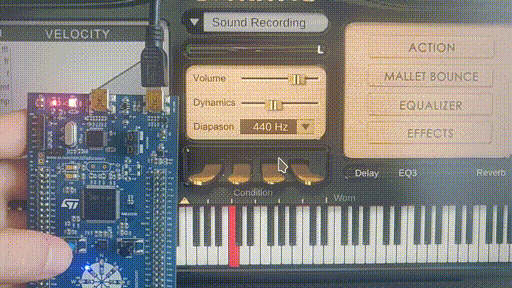

# OpenMidiSurface
## Project overview and goals
The goal of this project is to create a universal USB MIDI controller built upon the STM32F3 series MCUs. In particular, the STM32F303VCT6 MCU is on the cheaper side of the STM32 lineup, but at the same time it sports an impressive number of ADC channels (up to 40) and GPIO, which makes it ideal for custom MIDI controllers. The number of analog and digital inputs can be further extended with the use of multiplexers. It isn't difficult to imagine how this could be used to build a MIDI keyboard with 100 control knobs!
## The demo
In order to test the MIDI capabilities, the project implements a demo. Once you connect the `USB USER` port of your STM32F3Discovery board to your computer or tablet (Windows/macOS/Linux/iOS/etc.), it should be recognized as a USB class-compliant MIDI controller, named "OpenMidiSurface". No additional driver is needed. On you device, you can open a MIDI synth of your choice, and connect its MIDI input to the MIDI output of OpenMidiSurface. Each time you press the user button on the STM32F3Discovery board, a different note of blues scale will be played, and a different LED will be lit up. Enjoy!

  

## Future developments
Stay tuned :wink:
